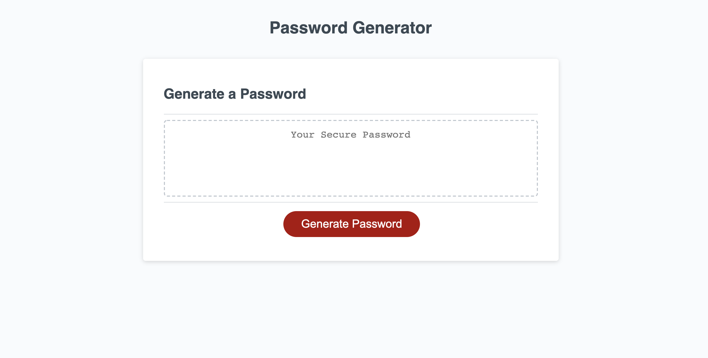
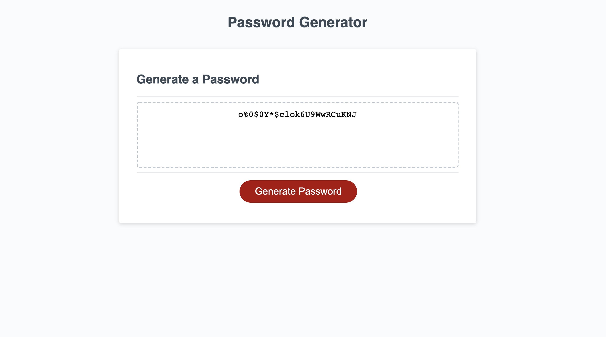

# random_password_generator

* [Abstract](#abstract)
* [Details ](#details)
* [What I Learned](#what-i-learned)
* [Installation and Usage](#installation-and-usage)
* [License](#license)

# Abstract

In this assignment, an employer needed a random password generator that, upon clicking/pressing the button, would allow employees to specify, through a series of prompts, the desired length of their password, as well as whether it would include lower/upper case letters, numbers, and/or special characters. The application would then run a series of functions in JavaScript and display a new password in the browser. 

This page has been deployed on Github, and can be viewed here: https://tomekregulski.github.io/random_password_generator/

# Details

This project features a simple layout with a button that the user can click, and text box that receives no direct user input. The basic function is that the user clicks the button, answers a series of prompts, and receives a randomly-generated password based on their answers to the prompts.

Behind the scenes, an event listener waits to capture a button click, which calls the function writePassword, which in turn calls the function generatePassword.

generatePassword begins a sequence of 5 prompts that record the user's desired length of password, as well as which groups of characters should be included in the generation process. 

Once the prompts have been answered, a string of the selected character sets is stored in the variable passwordSet. The password length is used as the second argument in a "for" loop, and a string of random characters selected from passwordSet is created and stored in the variable password. 

This result is passed back into writePassword, where it is set as the value for the variable passwordText, which in turn is passed to the text field in the HTML, and presented to the user as their new password. 

In addition to the above, I included a line of code that allows the user to cancel the process on the first prompt. In this case, they simply press cancel, and the process terminates. If they want to start it again, they simply have to press the button once more. 

# What I Learned

Through this exercise, I learned how javascript can accept an input from the user interface, and use that to call the necessary functions to generate and return a desired result. Furthermore, I feel that I have gained a stronger understanding of the proper syntax in javascript, particularly when it comes to working with several variables and functions that rely on thoughtful construction to function properly. 

Finally, I have learned how it can be beneficial to separate out certain functions, even if the task at hand could be written out in one block. Though both can work, keeping things separate results in cleaner code, and allows a particular function to be readily available to be used in other processes if needed. 

# Installation and Usage

Clone the repo and open the folder in the code editor of your choice. Launch the HTML in the browser of your choice. Click the "Generate Password" button, and follow the prompts in order to receive your password.

# License

MIT License

Copyright (c) [2021] [Tomek Regulski]

Permission is hereby granted, free of charge, to any person obtaining a copy
of this software and associated documentation files (the "Software"), to deal
in the Software without restriction, including without limitation the rights
to use, copy, modify, merge, publish, distribute, sublicense, and/or sell
copies of the Software, and to permit persons to whom the Software is
furnished to do so, subject to the following conditions:

The above copyright notice and this permission notice shall be included in all
copies or substantial portions of the Software.

THE SOFTWARE IS PROVIDED "AS IS", WITHOUT WARRANTY OF ANY KIND, EXPRESS OR
IMPLIED, INCLUDING BUT NOT LIMITED TO THE WARRANTIES OF MERCHANTABILITY,
FITNESS FOR A PARTICULAR PURPOSE AND NONINFRINGEMENT. IN NO EVENT SHALL THE
AUTHORS OR COPYRIGHT HOLDERS BE LIABLE FOR ANY CLAIM, DAMAGES OR OTHER
LIABILITY, WHETHER IN AN ACTION OF CONTRACT, TORT OR OTHERWISE, ARISING FROM,
OUT OF OR IN CONNECTION WITH THE SOFTWARE OR THE USE OR OTHER DEALINGS IN THE
SOFTWARE.
